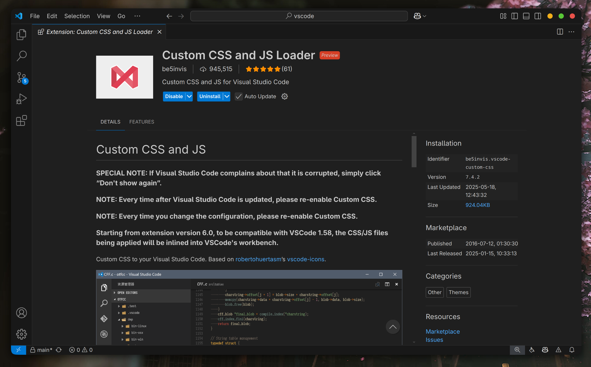

# 说明
一个脚本用于生成适用于vscode的CSS样式，该样式能让vscode具有whitesur-gtk风格的标题栏按钮。
生成的whitesur-gtk-vscode.css一般位于target/classes目录下。

生成的whitesur-gtk-vscode.css文件需要搭配vscode插件[Custom CSS and JS Loader](https://marketplace.visualstudio.com/items?itemName=be5invis.vscode-custom-css)使用。

需要修改vsocde的setting.json，往里面增加如下内容（注意把css文件的路径改为实际的路径）：
```
"window.controlsStyle": "custom",
"vscode_custom_css.imports": ["file://${userHome}/xxx/whitesur-gtk-vscode.css"]
```

效果：

